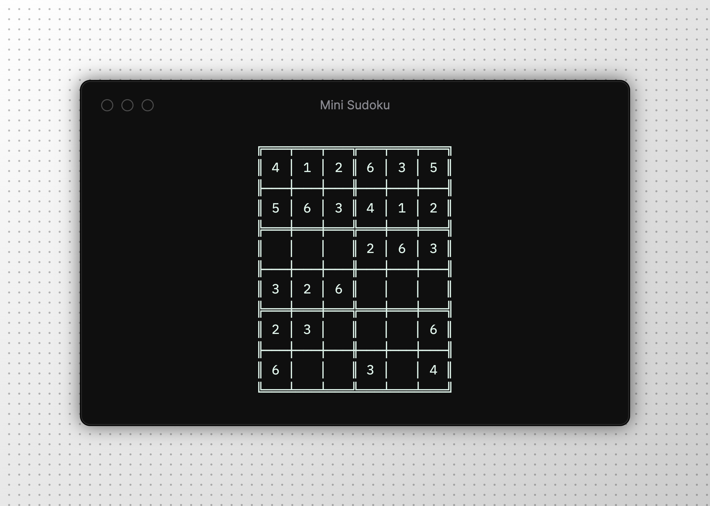

# Mini Sudoku

[](https://www.npmjs.com/package/mini-sudoku)
[](LICENSE)
[](package.json)

> A minimal Sudoku (6×6) game for the terminal

---

**Keep your brain in shape while your agents do your work!**

🕹️ No install needed — just run `npx mini-sudoku` and start playing!




## Quick start

```bash
npx mini-sudoku
```

You'll be prompted to select a difficulty level. Once in the game, use the controls below to play.

## Controls

| Key | Action |
|-----|--------|
| `↑` `↓` `←` `→` | Move the cursor |
| `1` – `6` | Fill the selected cell |
| `x` | Delete the cell value |
| `Ctrl+R` | Reset the board |
| `Ctrl+C` | Quit |

## Options

| Flag | Alias | Description |
|------|-------|-------------|
| `--level <easy\|medium\|hard>` | `-l` | Skip the prompt and start at the given difficulty |
| `--help` | `-h` | Show the help message |

## License

MIT — see [LICENSE](LICENSE) for details.

